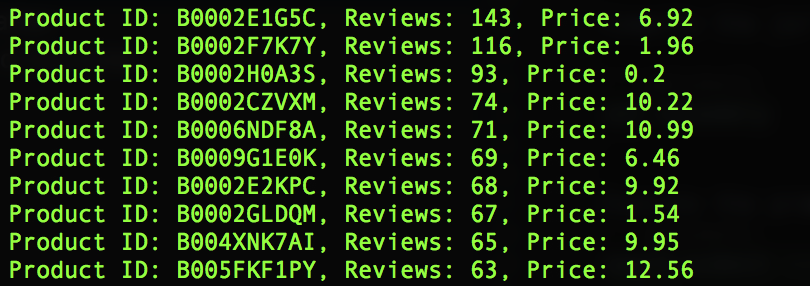

## CS 5344 Lab 2 submission

### Compile and execute
Clone this repository and cd to the respective project
```sbtshell
git clone https://github.com/JKOK005/nus-monorepo.git

cd CS5344/lab-2
```

Compile the jar and install all dependencies located in `build.sbt`

```sbtshell
sbt assembly
```

Execute the programme as a spark job with the following parameters
```sbtshell
spark-submit --master local[2] --deploy-mode client --conf "spark.hadoop.mapreduce.fileoutputcommitter.algorithm.version=2" \
--driver-memory 1G --executor-cores 2 --conf spark.dynamicAllocation.maxExecutors=2 --executor-memory 1G \
--class com.CS5344.lab_2.main ./target/scala-2.11/lab-2-assembly-0.1.jar
```

The top 10 products will be printed out in the console. 

For reference: 
